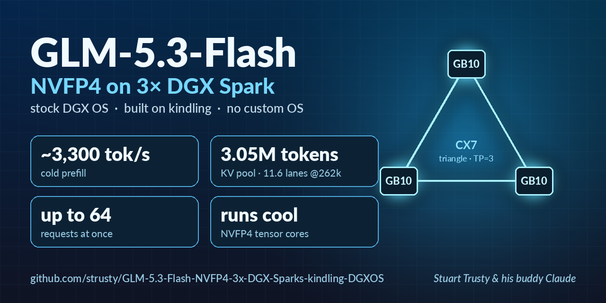

<h1 align="center">GLM-5.3-Flash NVFP4 on three DGX Sparks, stock DGX OS</h1>

  built on <a href="https://github.com/kindlingai/glm-5.3-flash-gx10">kindling</a>
    
  
  
  
  
   
  
  
  
  

  

Serve **GLM-5.3-Flash** from three NVIDIA DGX Sparks / ASUS Ascent GX10 (GB10, 128 GB each), cabled as a
triangle on their ConnectX-7 ports with no switch, through an OpenAI-compatible API. It runs
[kindling](https://github.com/kindlingai/glm-5.3-flash-gx10) (vLLM, NVFP4, DFlash2, ARX, mentat) at TP=3, **on the
stock DGX OS that ships on the box**. You get the memory gains of kindling's custom OS without installing it, plus
TP=3 tunings measured over a weekend of agent traffic.

**Why use it:** a workhorse that runs cool. There is no practical cap on the number of working threads, and
prefill feels almost instant.

- **~3,100–3,500 tok/s cold prefill.** A 64k-token prompt is ready in 20 s; resending it takes 0.41 s.
- **Output spikes to ~480 tok/s** aggregate on code with a dozen-plus streams (sparkDash's live readout; the
  best full 512-token run measured 410 tok/s at 12 streams, and the tables below give medians).
- **No 8-request cap.** vLLM schedules up to 64 sequences. The FP8 KV pool holds **3,054,135 tokens**, which is
  **11.65 full 262k-token conversations** at once (or ~45 at 66k). Bursts of 12–15 concurrent agents run without queuing.
- **Runs cool.** The NVFP4 tensor-core path keeps a GB10 out of thermal clamps that EXL3 trellis decode hits
  (head clamps ~0.6/h against ~21/h on an EXL3 engine on the same boxes).
- **Same intelligence.** With thinking on, the way agents run it: GSM8K 98.4% and HumanEval 93.9% at the default low
  reasoning effort, 99.2% and 98.2% at max effort. Thinking off: GSM8K 96.4% on all 1,319 problems, HumanEval 94.5%.
- **Fair to a crowd of agents (v1.1, opt-in).** While one agent's 100k-token prompt is read in, the others keep
  writing at 4.6–4.9 tok/s instead of 1.5–1.7. An interactive turn behind a burst of six sub-agent prompt reads gets
  its first token in 12.7 s instead of 38.6 s. See [Many agents at once](#many-agents-at-once-v11-opt-in).
- **Agent-safe tool calls.** Nested or abandoned GLM tool calls are refused with a recovery hint instead of
  executed, and long buffered calls send keep-alives.
- Checkpoint: [`nvidia/GLM-5.3-Flash-NVFP4`](https://huggingface.co/nvidia/GLM-5.3-Flash-NVFP4)
  (zero-padded for TP=3 by kindling's `experimental/tp3/make_padded.py`).
  Drafter: [`incoai/GLM-5.3-Flash-DFlash2`](https://huggingface.co/incoai/GLM-5.3-Flash-DFlash2).
- Context: **262,144 tokens** per request (a longer window starts but isn't memory-safe on this configuration;
  see [Limits](#limits)).

## Performance

Measured with [sparkDash](https://github.com/MiaAI-Lab/sparkDash) (the same tool other GB10 recipes publish with) on
a warm engine. Every run waited for an idle server and was repeated if live traffic overlapped it. Three ASUS GX10,
DGX OS, kernel `6.17.0-1026-nvidia-64k`, drivers 580.159.03 / 580.173.02, CX7 triangle. Full tables and method:
[docs/MEASUREMENTS.md](docs/MEASUREMENTS.md).

**Decode, aggregate tok/s (512-token replies)**

| Concurrent requests | 1 | 4 | 8 | 12 |
| --- | ---: | ---: | ---: | ---: |
| Prose | 66.3 | 115.6 | 155.5 | 178.8 |
| Code | 106–118 | 189–230 | 267–327 | 298–376 |

Code swings ±15–30% from run to run at the same settings (DFlash2 acceptance on code is bursty), so ranges are given.
The best code run reached 410 tok/s at 12 streams, and the live readout has spiked to ~480 tok/s.

**Prefill (cold) and time to first token**

| Prompt | Prefill | Time to first token |
| ---: | ---: | ---: |
| 8k | 3,121 tok/s | — |
| 16k | 3,374–3,417 tok/s | — |
| 64k | 3,528–3,558 tok/s | 20.0 s |
| 131k | 3,494 tok/s | — |
| 248k | 3,135–3,204 tok/s | 77 s |

| Resume | Time to first token |
| --- | ---: |
| The same 64k prompt sent again | 0.41 s |
| A new conversation with the same ~8k system prompt | 0.28 s (cold: 3.10 s) |
| An agent's next turn (previous prompt + reply + ~800 new tokens) at 26k / 79k / 157k | 0.60 / 0.94 / 1.08 s |

**Memory** (the head, rank 0, is the tightest box). Lowest free memory with a 248k-token cold prompt: **6.2 GiB**
on the head, 8.5–8.9 GiB on the workers. Under a 12-stream bench: 6.5 GiB.

**Quality** (greedy, thinking off, every output kept): GSM8K **96.4%** on the full 1,319-problem test set (97.2%
on the first 250). All 48 misses were genuine reasoning slips in short answers; asked again with thinking on, 16–21
of them come right (~97.6–98.0%). HumanEval **94.5%** (155/164). See [docs/MEASUREMENTS.md](docs/MEASUREMENTS.md#quality).

**Reasoning effort, low vs max** (thinking on, greedy, 16 requests at a time). Effort is per request:
`chat_template_kwargs: {"reasoning_effort": "low"}`; any value other than `low` or `high` renders as Max.

| | Low (the default) | Max |
| --- | ---: | ---: |
| GSM8K, first 250 | 98.4% | 99.2% |
| HumanEval | 93.9% (154/164) | 98.2% (161/164) |
| Wall time, GSM8K / HumanEval | 108 s / 108 s | 505 s / 2,554 s |
| Mean reply length, GSM8K / HumanEval | 79 / 169 tokens | 364 / 2,153 tokens |
| Decode at 12 streams, prose / code (thinking counted) | 137 / 190 tok/s | 139 / 162 tok/s |

Max thinks 5–13× longer for about one point on GSM8K and four on HumanEval. On code it also decodes slower, because
its output is mostly reasoning, which DFlash2 drafts like prose. 3 of 414 max-effort answers thought until a 32k
cap. Low stays the default.

### Many agents at once (v1.1, opt-in)

Raw speed is not the bottleneck for a crowd of agents. Two things are:

- one agent's long cold prompt nearly stops everyone else's stream while it is read in;
- an interactive turn queues behind a burst of sub-agent prompt reads.

Two opt-in scheduler knobs fix both. A third tags sub-agents for clients that can't send vLLM's `priority` field
(Hermes sub-agents are the example). Measured on these boxes, bench traffic only, every run on an idle engine:

| Test | Before | After |
| --- | --- | --- |
| A 100k-token cold prompt read beside 4 decoding streams | streams 1.5–1.7 tok/s; read 37 s | `cadence 4`: streams **4.6–4.9 tok/s**; read 43 s |
| 6 sub-agent 20k prompts + 1 interactive 8k prompt at once | interactive first token 38.6 s | priority + parking: **12.7 s** (sub-agents 35–40 s) |
| Plain decode 1–12 streams, cold prefill 16k / 64k | — | unchanged within noise |

- The trade is a longer cold read (+16% at cadence 4; cadence 8 gives the others 7.9 tok/s for a 51.5 s read).
  That is why these are knobs and not defaults.
- The code is two commits on our kindling fork, proposed upstream in
  [kindling #87](https://github.com/kindlingai/glm-5.3-flash-gx10/issues/87). Both apply cleanly to the pinned
  a3c3a1d.
- To use them, on every box:

      curl -sL https://github.com/strusty/glm-5.3-flash-gx10/commit/d0d5cf2.patch | git -C ~/glm53-kindling am
      cat >> ~/glm53-kindling/compose/.env <<'X'
      SCHED_ARGS=--scheduling-policy priority
      VLLM_PREFILL_CADENCE=4
      VLLM_PRIO_PREFILL=1
      # Hermes sub-agents (" focused subagent working on a specific delegated task") at priority 5:
      VLLM_MARKER_PRIORITY=5
      VLLM_MARKER_IDS=10730,1186,8091,3238,389,264,3151,89908,3383
      X

  Then `./scripts/stop.sh && ./scripts/start.sh`. A JSON file at `/root/.cache/sched-ctl.json` inside the
  container overrides any knob live (e.g. `{"cadence":4,"prio_prefill":1}`), for A/B tests without a restart.
- The second commit, [`c8e9bff`](https://github.com/strusty/glm-5.3-flash-gx10/commit/c8e9bff), adds an opt-in
  `effort_tail` to the chat template. It moves the effort line to just before the reply, so an agent can change
  effort mid-conversation without re-reading its history.
  - The default render is token-identical.
  - At the tail the model still honours max effort: GSM8K 39/40 at 247 tokens vs 38/40 at 271.
  - It takes effect after an image rebuild, or by mounting the template over `/usr/local/share/glm53-chat-template.jinja`.

## Why this instead of kindling-spark-os or Mia's TensorFold recipe

**Compared with [kindling-spark-os](https://github.com/kindlingai/kindling-spark-os)** (kindling's own minimal OS):
it is an excellent piece of work, and two of its ideas are why this repo exists. It boots a read-only image in place
of DGX OS to get ~4 GB more memory per box: a 64 KiB-page kernel and *dispram* (lending the GPU's unused 2 GiB
display carveout to the KV cache). Both work on stock DGX OS:

- **dispram** is userspace. This repo fetches kindling-spark-os's dispram unmodified and builds its RM library
  against *your* driver's exact headers (the RM API headers are byte-identical across 580.159.03 / 580.173.02 /
  580.178.04). 2046 MiB per box passed a full fill/verify (0 wrong words), and GPU kernels read and write it at the
  same speed as ordinary memory. **+2 GiB of KV per rank.**
- **The 64K kernel** is Ubuntu's own Canonical-signed `nvidia-64k` flavour, with matching NVIDIA module builds for
  both drivers, already in DGX OS's apt. `dgxos/k64` switches each box behind a safety net: the saved default
  stays on the old kernel until confirmed, a one-shot trial boot reverts by itself unless confirmed over SSH,
  plus a hardware watchdog during the trial and `panic=10`. On these boxes it bought **~19–36% faster cold
  prefill**. Its RAM gain was mostly eaten by the NVIDIA driver retaining freed GPU memory on 64K pages (see [Limits](#limits)).
- **The bigger memory win needs no OS change at all:** capturing CUDA graphs at **21 batch sizes instead of
  vLLM's 57** frees **~7 GiB per rank** at equal speed. Half of that went to a bigger KV pin (14 → 18 GiB); the
  rest doubled the head's headroom.

You keep DGX OS, NVIDIA's dashboard and support path, and anything else you run on the boxes.

**Compared with [Mia's TensorFold recipe](https://github.com/MiaAI-Lab/GLM-5.3-Flash-EXL3-2x-DGX-Sparks-TensorFold)**
(v1.5, three Sparks, experimental). Her numbers are from her README; both sides are sparkDash.

| | This repo | Mia v1.5, three Sparks |
| --- | --- | --- |
| Cold prefill 8k / 64k / 262k | **3,121 / ~3,540 / ~3,150** tok/s | 2,001 / 2,004 / 1,655 tok/s |
| Code, 6–8 requests | **~230–327** tok/s | 193–212 tok/s |
| Requests at once | **up to 64** (pool 3.05M) | 8 (pool 4.0–4.2M) |
| Prose, 1 request | 66 | **77.6** (4-stream mode) / 65.7 (8-stream default) |
| Prose, 8 requests | 155 | **166** |
| Window | 262k | **1M** |
| Resume (identical 64k / shared system prompt) | 0.41 / 0.28 s | **<0.07 / 0.13 s** |
| Head free memory under load | 6.2–6.5 GiB | **11.5–12.5 GiB** |
| GSM8K / HumanEval (thinking off) | 96.4% (full set) / 94.5% | 98.8% (first 250) / 95.7% |
| GSM8K / HumanEval (thinking on, low / max effort) | 98.4 / 93.9% · **99.2 / 98.2%** | — |
| Heat | cool (NVFP4 tensor cores) | EXL3 trellis decode runs hot |

Her recipe is the better pick for a few long-context conversations (1M window, instant resume, best single-stream
prose). This one is the better pick for many agents at once: tool-heavy turns over big contexts, where the
prompt, not the reply, dominates the wait.

## Requirements

- Three GB10 boxes (DGX Spark or ASUS Ascent GX10) on DGX OS (Ubuntu 24.04), NVIDIA's open driver from DGX OS apt
  (580.159.03 and 580.173.02 tested), Docker, passwordless sudo for the admin user, ssh between the boxes.
- Each box cabled to the other two on its ConnectX-7 ports (a triangle; no switch), addressed per kindling's
  `experimental/tp3` README.
- kindling's prerequisites on every box: its image built, [mentat](https://github.com/mmastrac/mentat) running, and
  the TP=3 padded checkpoints (~180 GB) plus room for one ~69 GB weight snapshot per box.

## Running headless, and other switchless-triangle gotchas

**Run every box headless.**

- A logged-in desktop session keeps its framebuffer in the GPU's display carveout. dispram's fill/verify fails while
  one runs, so a box with a desktop gets no dispram (and vLLM sizes the KV pool by the smallest rank).
- A desktop also shares unified memory and the power budget with the model. kindling's own advice is not to
  benchmark with one running.
- On each box:

      sudo systemctl set-default multi-user.target
      sudo systemctl isolate multi-user.target     # now; or reboot

  Check: `systemctl get-default` prints `multi-user.target`, and `nvidia-smi` lists no `Xorg` or `gnome-shell`.
  Undo with `sudo systemctl set-default graphical.target`.
- What we saw: a GDM login screen with nobody logged in (Xorg + gnome-shell, ~25 MiB of GPU memory) did not stop
  dispram on one of our boxes. A logged-in desktop is what breaks it. Headless is the clean state.

**One RoCE GID index on every port.** kindling needs every fabric port on a box to share one RoCE GID index. An IPv6
link-local address on some ports pushes IPv4 to index 5. Disable IPv6 on every CX7 NetworkManager profile
(`nmcli connection modify <profile> ipv6.method disabled`), which puts IPv4 at index 3 everywhere. The boot gate in
`scripts/` checks for it.

**mentat island placement.** Each cable is its own subnet, so no mentat island holds all three GPUs and placement
sits PENDING. Set `MENTAT_ISLAND_PLACEMENT=off` on every `mentatd`.

**Pin the head.** mentat elects the lowest LAN address as head. If the box that should serve the API isn't the
lowest, set `ROLE` and `HEAD_HOST` on each box.

## Quick start

On the **head** (the box that serves the API):

    git clone https://github.com/strusty/GLM-5.3-Flash-NVFP4-3x-DGX-Sparks-kindling-DGXOS.git && cd GLM-5.3-Flash-NVFP4-3x-DGX-Sparks-kindling-DGXOS
    cat > scripts/local.sh <<'X'
    WORKER1=admin@box2      # ssh targets of the other two boxes (LAN)
    WORKER2=admin@box3
    X
    ./scripts/install.sh    # kindling @ a3c3a1d + patches + overlay + parser + settings, on all three boxes

Optional, recommended: **dispram** (+2 GiB KV per rank). On every box, then verify with the engine stopped:

    ./dgxos/dispram/install-dispram.sh && python3 dgxos/dispram/verify.py

Optional: **the 64K kernel** (faster prefill). One box at a time, engine stopped, ideally with physical access the
first time ([dgxos/k64/README.md](dgxos/k64/README.md)):

    dgxos/k64/prepare.sh   # no reboot: safety net + 64K packages; the default stays on today's kernel
    dgxos/k64/arm.sh && sudo systemctl reboot    # one-shot trial; reverts by itself in 15 min unless confirmed
    dgxos/k64/verify.sh && dgxos/k64/confirm.sh  # after it is back: ~29 checks, then make 64K the default

Start, and prove it:

    ./scripts/start.sh      # all ranks down, up head-first, ARX ring order check, /health, one real generation
    (cd ~/glm53-kindling && bash smoketest/run.sh http://127.0.0.1:8888 GLM-5.3-Flash)

At boot, gated on docker, mentat, all four CX7 links and RoCE GIDs on every box:

    sed "s#@REPO@#$PWD#; s#@USER@#$USER#" scripts/glm53-triangle.service | sudo tee /etc/systemd/system/glm53-triangle.service
    sudo systemctl daemon-reload && sudo systemctl enable glm53-triangle

## Configuration

`scripts/config.sh`, overridden by `scripts/local.sh`. `install.sh` writes them into each box's `compose/.env`.

| Setting | Default | What |
| --- | --- | --- |
| `WORKER1`, `WORKER2` | — | ssh targets of the two other boxes |
| `KV_CACHE_MEMORY` | `19327352832` (18 GiB) | KV pin per rank. **Only with `GRAPH_SIZES` below**: with vLLM's own 57 graph sizes the graphs take ~10 GiB per rank and 18 GiB leaves the head too little room. Measured on the 64K kernel with dispram; without them, start at 16 GiB and measure with `bench/longwin.sh`. |
| `GRAPH_SIZES` | `1 8 12 15 16 24 32 48 64 80 96 112 128 160 192 224 256 320 384 448 512` | CUDA-graph capture sizes (tokens per step). Keeps every adaptive-k decode shape for 1–5 requests and steps of 8–16 to 128. 21 sizes take 3.2–4.0 GiB per rank against 10.2–10.8 GiB for vLLM's 57, at equal speed. |
| `MAX_MODEL_LEN` | `262144` | per-request window ([Limits](#limits)) |
| `DT_TAU` | `0.3` | kindling's draft-trunc threshold (0.2 / 0.3 / 0.45 measured flat; 0.3 best) |
| `NETDEVS`, `F0_HCAS`, `F1_HCAS` | GB10 defaults | CX7 netdevs and the ARX ring's RDMA devices; `start.sh` swaps the two lists once if mentat orders the workers the other way round |
| `CABLE_CHECKS` | empty | optional `host src dst` lines the boot gate pings |
| `SCHED_ARGS` | empty | extra engine flags; `--scheduling-policy priority` for [Many agents at once](#many-agents-at-once-v11-opt-in) (set in `compose/.env`) |
| `BREAKABLE_CG` | `1` | vLLM's breakable CUDA graphs ([Limits](#limits)); `0` only if you hit kindling #85 (set in `compose/.env`) |

## What this changes on top of kindling (a3c3a1d)

| | File | Why |
| --- | --- | --- |
| TP=3 triangle overlay | `compose/triangle-dgxos.yaml` | ARX ring on direct cables with the one-shot limit raised to its compiled 512 KiB (decode batches of ~6–11 requests stay off NCCL), the DFlash block-drop fix, `--prefix-match-unit 64`, the repair parser, dispram mounts, the 21 graph sizes, low default reasoning effort |
| Drafter-pool skip | `patches/0001-…` | `copy_kv_cache_blocks_inplace` walked the DFlash drafter's own KV pool with target block ids; the first partial prefix hit crashed every rank. This is what makes 64-token prefix matching safe: a follow-up turn computes ~780 new tokens instead of ~1,740. Proposed upstream as [#76](https://github.com/kindlingai/glm-5.3-flash-gx10/issues/76). |
| megamoe no-expert rows | `patches/0002-…` | rows vLLM marks with expert -1 crashed every mixed prefill+decode batch. Fixed upstream later in 6ffa0b6 (#67). |
| Tool-call repair | `compose/glm47_repair.py` | subclasses kindling's `glm47_failclosed`. Calls opened inside the reasoning, or abandoned mid-argument (5 of 5,094 on real agent traffic), are refused with the recovered call spelled out, never executed. Plus keep-alives while a long call is buffered, and the tool name sent once (OpenAI SDK clients concatenate deltas). Tests: `tests/test_glm47_repair.py`, 19/19. |
| dispram on DGX OS | `dgxos/dispram/` | see above |
| 64K kernel on DGX OS | `dgxos/k64/` | see above |
| Launch | `scripts/` | all three ranks down, then up head-first; fix the ARX ring order once if mentat mirrors it; /health; one generation. Boot gate with the RoCE GID-3 fix. |
| Opt-in scheduling, effort tail (v1.1) | kindling fork commits `d0d5cf2`, `c8e9bff` | not installed by default; see [Many agents at once](#many-agents-at-once-v11-opt-in). Proposed upstream as [#87](https://github.com/kindlingai/glm-5.3-flash-gx10/issues/87). |
| Measurement | `bench/` | idle-gated sparkDash benches, a guarded long-prompt needle test, GSM8K/HumanEval with a sandbox and miss classification |

## Limits

- **Window.** `MAX_MODEL_LEN=1048576` (the model's native maximum) starts and serves, but a ~500k-token cold
  prompt drove the head to 2.0 GiB free (the guard in `bench/longwin.sh` aborted it). The engine then kept that
  peak until restart. Long prefill's working memory grows with context: ~2.7 GiB at 250k, ~4.5 GiB at 500k on the
  head. A 1M window needs a smaller long-prefill chunk or a smaller KV pin, then re-testing. Not done.
- **64K kernel RAM.** The kernel returns 2.1 GiB of page bookkeeping per box. Under identical load on two workers
  (one on 4K, one on 64K), the 64K box's NVIDIA driver kept ~1/4 of the GPU memory processes freed (≈+3.5 GiB of
  memory no counter shows), plus ~1.9 GiB more page cache. Take the 64K kernel for prefill speed, not capacity.
  Cause not yet located (RM, UVM or libcuda); NVIDIA's 580.178.04 not yet compared.
- **Async scheduling** is unavailable with kindling's Ray/mentat executor in this vLLM. During single-stream
  decode the head GPU is busy 96% of the time anyway, so it could win at most ~4%.
- **Copy drafts** (TensorFold's prompt-lookup drafts): simulated over 3,040 real agent replies, only 12% of
  generated tokens repeat context, and even a perfect selector gives ~1.00× over DFlash2. Not built.
- **A restart empties the prefix cache**, so every conversation's next turn pays one cold prefill: 41 s for an
  87k-token agent conversation. Replaying each conversation's last request at low priority right after a restart
  brings that to 2.4 s. It needs a request proxy that keeps those requests, so it isn't in this repo yet.
- **Breakable CUDA graphs** stay on. kindling #85 reports a TP=3 rank-0 crash with them on vLLM's mp executor. On
  mentat we have seen none in 2.5+ days of agent traffic sampling at top_p 0.95, and turning them off cost 8% of
  cold prefill and 25% of code decode at 8 streams. If you hit it (`Triton Error [CUDA]: operation not permitted`
  on rank 0), set `BREAKABLE_CG=0` and restart all three ranks together.
- **Heat on the head.** Under sustained 8–16-stream load (benchmarks, max-effort evals), our head's hottest SoC sensor
  reached 90–94 °C while its GPU read 69–77 °C. The workers stayed cooler. The head also runs the API server and
  scheduler. Give it the best airflow, and watch `/sys/class/thermal/thermal_zone*/temp` rather than the GPU
  temperature alone.
- kindling has moved on since a3c3a1d (c748079 adds its own dispram integration for kindling-spark-os). This
  recipe pins what was measured.

## Repository layout

    compose/triangle-dgxos.yaml   TP=3 overlay (stack last)        compose/glm47_repair.py   tool-call parser plugin
    patches/                      two fixes for kindling a3c3a1d   tests/                    parser tests (run in the image)
    scripts/                      config, install, start/stop, boot gate, systemd unit
    dgxos/dispram/                dispram on stock DGX OS          dgxos/k64/                64K kernel with a safety net
    bench/                        sparkDash wrapper, needle/long-window test, GSM8K + HumanEval
    docs/MEASUREMENTS.md          every number above, with method

## License

The files in this repository are MIT ([LICENSE](LICENSE)). Nothing from kindling is redistributed here:
`install.sh` clones it from its own repository at a pinned commit, and the two patches are diffs against it.
dispram is fetched from kindling-spark-os at install time and keeps its licences (server AGPL-3.0, client GPL-3.0
with a bundling exception).

## Thanks

- **[kindling](https://github.com/kindlingai/glm-5.3-flash-gx10)**: the engine everything here runs on. Its vLLM
  integration, ARX, adaptive-k, draft-trunc, megamoe, dense FP8/NVFP4, weight snapshots and fail-closed GLM parser
  are what make NVFP4 fast on GB10. [kindling-spark-os](https://github.com/kindlingai/kindling-spark-os) gave us
  dispram and the 64 KiB-page / THP-off insight; this repo is a way to take those gains without its OS.
- **[Mia's AI Lab](https://x.com/MiaAI_lab)**: the [TensorFold recipe](https://github.com/MiaAI-Lab/GLM-5.3-Flash-EXL3-2x-DGX-Sparks-TensorFold)
  that set the bar and inspired the resume and tool-call work, and [sparkDash](https://github.com/MiaAI-Lab/sparkDash),
  the benchmark everyone shares.
